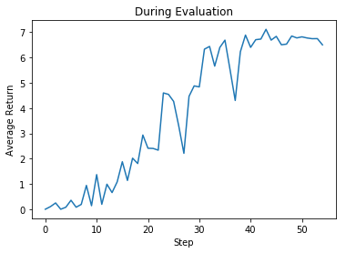

# rainbow-unity-obstacle-tower-challenge

Run [video_demo.ipynb](samples/video_demo.ipynb) to see an example of video segmentaion.

Original [Mask-RCNN](https://github.com/matterport/Mask_RCNN) is used in object detection and scene segmentation.
