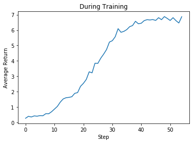

# rainbow-unity-obstacle-tower-challenge
The following figures show the average returns after training the Rainbow RL algorithm on the Unity Obstacle Tower Challenge.

Each step represents 250,000 frames for the training phase and 125,000 frames for the evaluation phase.
Further information about the challenge: (https://www.aicrowd.com/challenges/unity-obstacle-tower-challenge) 

Run [video_demo.ipynb](samples/video_demo.ipynb) to see an example of video segmentaion.

Original [Mask-RCNN](https://github.com/matterport/Mask_RCNN) is used in object detection and scene segmentation.
